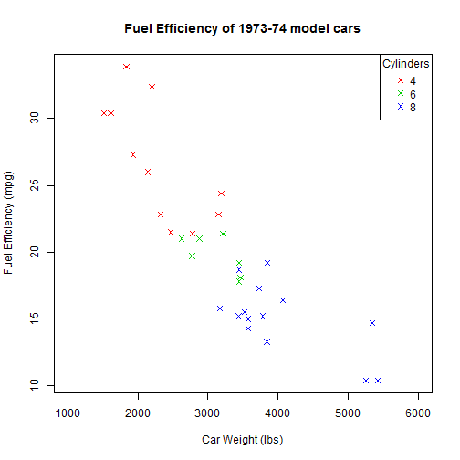

Fuel Efficiency Estimator
========================================================
Choosing a car? Consider features for fuel efficiency

Zeydy Ortiz, Ph. D.

Energy Crisis
========================================================

It's 1974 and you are trying to choose the best car for your family.  The [oil embargo](http://www.history.com/topics/energy-crisis) imposed by the Organization of Arab Petroleum Exporting Countries (OAPEC) is causing fuel shortages and prices are sky-high.  It's time to consider the features of the 1973-74 models that will help your family save at the pump.

Presenting the Fuel Efficiency Estimator
========================================================

Available at: http://zortiz.shinyapps.io/AutoFuelEfficiency

Explore the Fuel Efficiency Estimator
========================================================
With the Fuel Efficiency Estimator, you can find out:
- How cars with the same number of cylinders compare in fuel efficiency?
- Will a 4-, 6-, or 8-cylinder car be more efficient (for same weight)?
- How will fuel efficiency be affected if the car is carrying a heavier load?

Navigating the Fuel Eficiency Estimator
========================================================
To get an estimate of fuel efficiency, select the two major features of the 1973-74 car models that were found to determine fuel consumption:

- number of cylinders: 4, 6, or 8
- car weight in lbs

The right side shows a plot of the data featured in the *1974 Motor Trend US magazine*.  The figure also includes a data point for the estimated fuel efficiency of the input selections.

Below the plot are the **results of the prediction**. You can clearly see how changes in car features will affect the expected fuel consumption.

About the data and model
========================================================
  

 

* * *

The Fuel Efficiency Estimator uses the R *mtcars* dataset.  I previously developed the fuel efficiency model for the *Regression Models* class: 

`mLm <- lm(mpg ~ wt * cyl, mtcars)`
